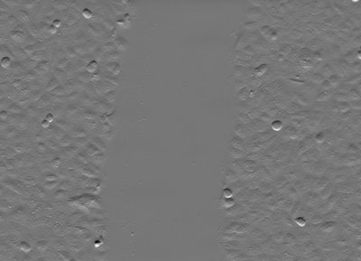
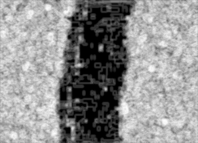
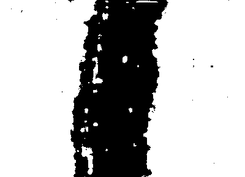
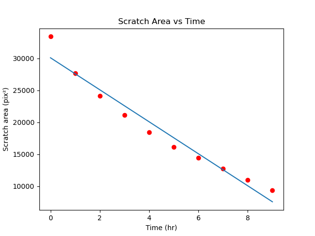

# Image Processing and Analysis of the Scratch Assay
Scratch assay or Wound healing assay is one of the common assays in biology. It involves segmenting time series images for cell migration (cell-filled & cell-unfilled) regions. we process by taking an image every one hour then by using image processing libraries like scikit-image and openCV, the area of the cell unfilled region is calculated and noticed that the area decreases over time due to the cell migration as shown in the animated videos. the code explains the segmentation process using Entropy filter and Otsu thresholding in Python. 

<div align="center">
<p>

 
 
</p>
</div>
<div align="center">
<p>

</p>
</div>


## Installation

Use the package manager [pip](https://pip.pypa.io/en/stable/) to install the dependencies.

```bash
pip -r requirements.txt
```

## Usage: scratch_process()

```python
#input :images path
#output: area vs time lists
# output controls:
save_results=True #save the output images (entropy & binary)
print_results=True #print the area calculated for each image
coeffients=True     #print the coeffients of best fit line of (Area,time) points
plot_resluts=True  #plot and fit line of (Area,time) points
gif=True    #create animated videos of input, entropy and binary images
report=True #create a text file saving the results
all_parameters=True  #makes all parameters of the function true 
```

## References
- [An introduction to the wound healing assay using live-cell microscopy](https://www.ncbi.nlm.nih.gov/pmc/articles/PMC5154238/pdf/kcam-08-05-969641.pdf)

- [Scratch assay analysis with just 5 lines code in Python](https://www.youtube.com/watch?v=jcUx-TQpcM8)
